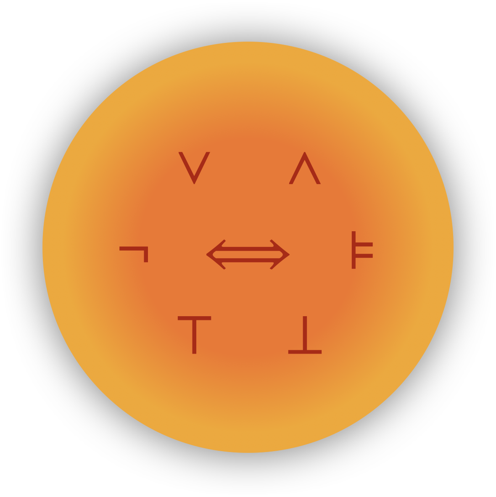

# Dragon Ball Z3: A Wish-granting Theorem Prover for Everyone


## Input
Dragon Ball Z3 (DBZ3) takes an input as a list of tuples `(sid, wish, happiness)` where
`sid`, `wish` and `happiness` are integer values each of which denotes a student id, a wish id,
and a happiness score.

## Output
The output of DBZ3 is an assignment from `sid`s to `wish`s that maximizes the total
happiness score of all students.

## Setup

This project can be built on the provided OCaml environment (Docker image or KCLOUD vm) to students.

After running `make` under the project root directory, one can check `assemble` generated.

## Run
```
./assemble [ NUM_STUDENTS ] [ NUM_PAPERS ] [ PREFERENCE_CSV ]
```
For example, `./assemble 3 3 examples/simple.csv` command assumes three students, three papers and each student's wish is denoted as a row of `example/simple.csv`.
